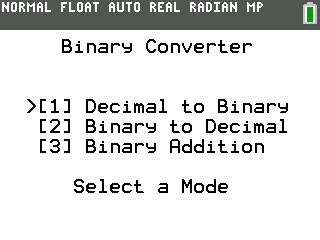

# TI84CE-Binary

A program written in C for the TI-84 Plus CE Calculator that converts between decimal and 8-bit signed (two's complement) binary

### Install Instructions

1. Download the program from https://github.com/mnxn/TI84CE-Binary/releases/ or build it yourself

2. Use [TI Connect CE](https://education.ti.com/en/products/computer-software/ti-connect-ce-sw) or a similar program to move the file to your calculator 

### Build Instructions

1. Install the TI-84 Plus CE toolchain from https://github.com/CE-Programming/toolchain/releases

2. Make sure the `CEDEV` environment variable is set and the `bin` folder of the toolchain is on the PATH

3. From the commandline, run `make`

4. The generated program will be in `bin/Binary.8xp`

## Images

### Main Menu

### Decimal To Binary

### Binary to Decimal

### Binary Addition

